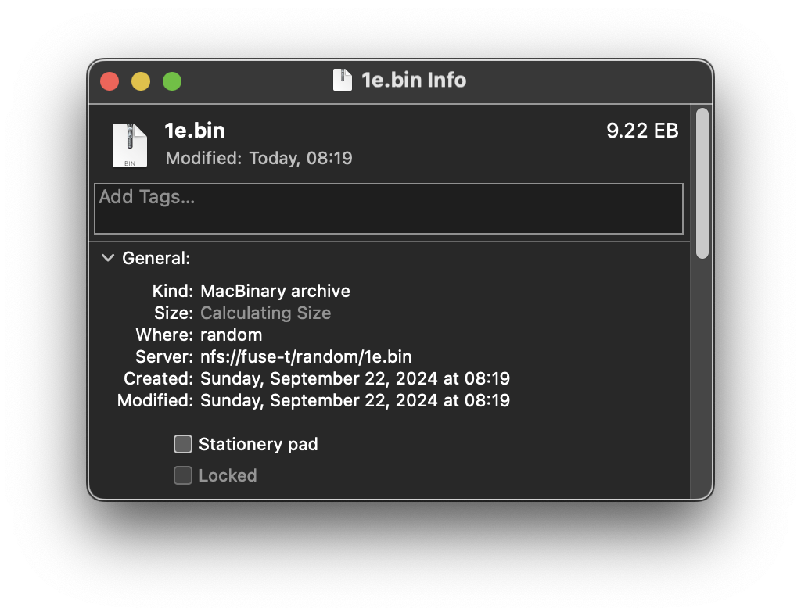
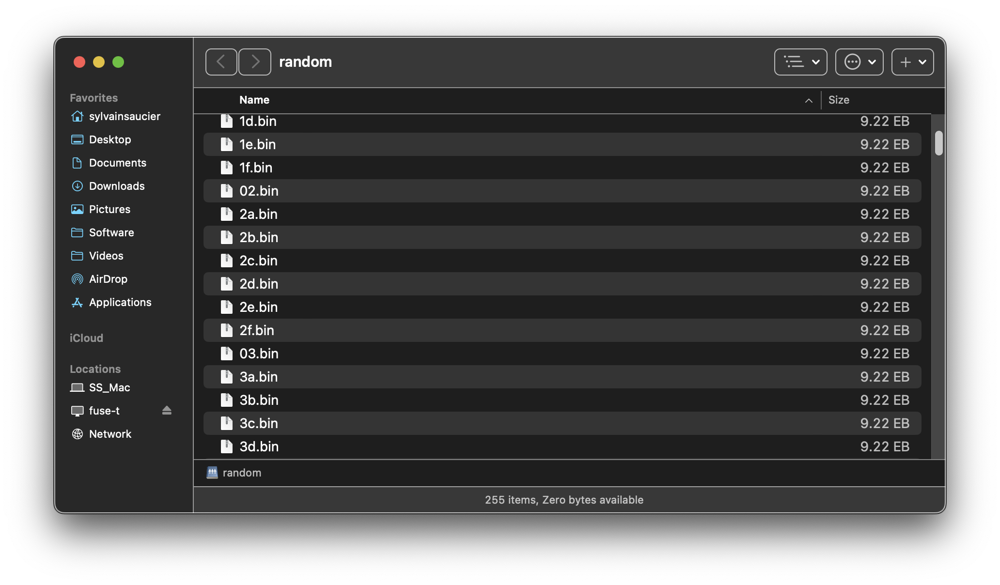
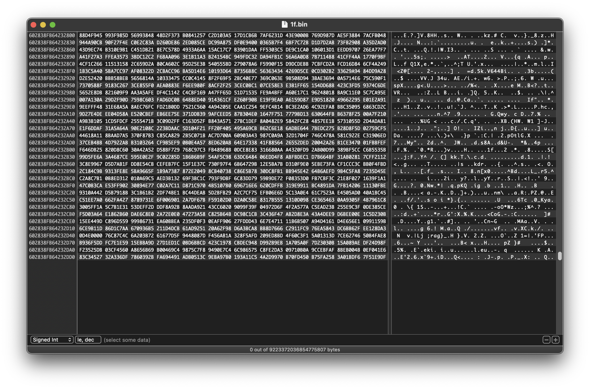
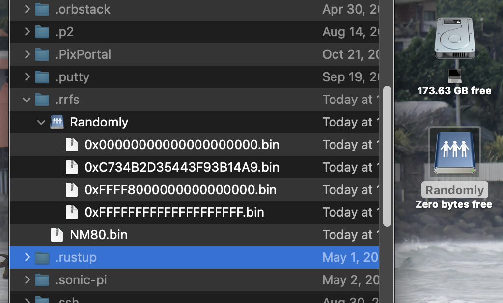
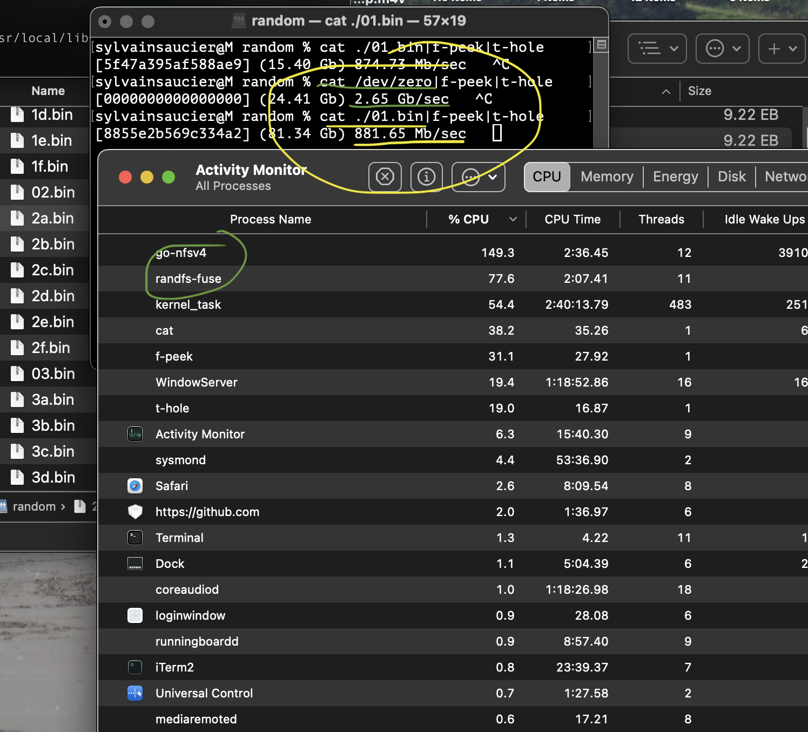
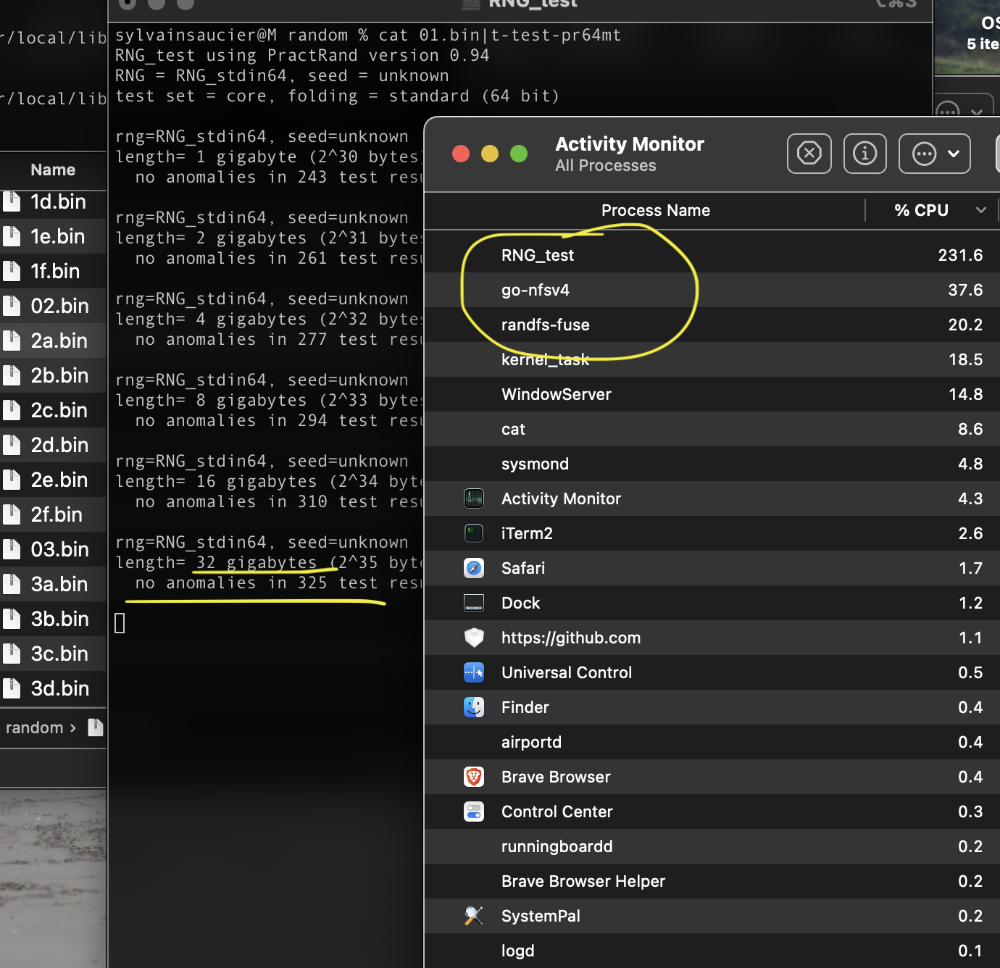

# Randomly Random File System

**0.1a**

We all know /dev/random, it offers the capability to generate a sequence one byte/block at a time. We cannot usually playback the past bytes or predict the bytes far ahead. This is excellent for cryptographic applications where secrecy is essential.

The **Randomly Random File System (RRFS)** expose 1 YottaByte (1 Tera-Terabyte) of randomly adressable random data.  It's data is accessed like any files and include seeking. Supporting 80 bit "adresses" using "63 bit" file offsets posed some challenges, test the limits of my computer and let me see what macos look like when it crashes.

RRFS is available under a BSD Licence. These are my notes telling the story of how this file system works, step by step, from mount to dismount.

## Installation

0. Install [FUSE-T](https://www.fuse-t.org/)
1. Download [sysaulab/libseedy](https://github.com/sysaulab/libseedy).
2. Using a Terminal, "cd" to the /FUSE directory.
3. Type "make" to build the program
4. Type ./rrfs to mount create and mount your Yottabyte or random files.

## Practical limits

The largest reported filesize macOS can work with, despite reporting handling 64 bit offsets, is actually half of that. 0x7FFFFFFFFFFFFFFF is the maximum reported file size that does not break the operating system.

MacOS effective maximum reported file size: 9,223,372,036,854,775,807 bytes. At this point the finder cannot tell you it's size with precision but we have the 9.22 EB (8EiB) displayed in the corner and in the folder view.

To see the data in the files, I used the excellent [Hexfiend](https://hexfiend.com). The latest version of the program handles the extremely large files very well. The only complain I have is a minor display issue. The information displayed can be cut when we scroll down. [🐞](https://github.com/HexFiend/HexFiend/issues/488)

## How it works, from mount to data

### Initialization

1. The first thing RRFS does, is create the ~/.rrfs/Randomly directory if it does not exist
2. Load the state from ~/.rrfs/NM80.bin or create a new one if it does not exist
	1. Initialize a ChaCha-20 generator with libseedy.
	2. Use the ChaCha-20 generator to populate the noise map of NM80.
	3. Fill the uninitialized iterators with 0xff bytes.
	4. Save NM80 structure to disk.
3. Unmount any filesystem ~/.rrfs/Randomly
4. Mount RRFS in ~/.rrfs/Randomly
5. Wait for calls...

### Directory listing

Due to Posix limitation I cannot expose files larger than (2^31)-1 bytes. That would require 131,072 enourmous files and one little file of 131,072 bytes to account for the last byte (the -1 above) of every logical block provided. Due to inexperience and using non-native FUSE-T library, I struggle to pass such a large amount of entries without corrupting the Finder or crashing macos. It is black text over white background[^jo] if you want to know.

I got around the problem by breaking away from the standard (every files that can be opened must be listed). That way I could list a few from the start and the last two one to let the user understand how it works. That take care of the problems I experienced so far, but it is not POSIX compliant. It is regrettable commercial operating systems providers are not providing native libFUSE implementations. [🐜](https://github.com/macos-fuse-t/fuse-t/issues/63)

This is what happen when a directory get listed:

1. Receive a diropen() call, respond with a valid handler.
2. Respond to readdir() calls with a file that represent :
	1. 0x0.bin
	2. 0x???\_RANDOM\_PICK\_???.bin 
	3. 0xFFFF8000000000000000.bin
	4. 0xFFFFFFFFFFFFFFFFFFFF.bin
3. Properly release the memory allocated when answering the dirclose call.

### Filesystem statistics

This is how you inform the host about your file system as a whole. For example, you can declare how many bytes your device contains and how many are available. Both of these numbers are (on macos anyway) exactly as large as one exposed segment (1/131072)th of it's potential size. Since the discrepancy between the limit and my actual representation, I decided to simply leave everything to 0 when it comes tp the filesystem.

### File attributes

When the OS wants to know about a file, it sends a stat request. To make my life easier, I mostly pass through the information from the mount folder is the request is for my "/" directory. If it is a valid file according to me, I make a copy of the stats of the database file. The following paths are recognized as valid:

1. "/"
2. "/.metadata\_never_index"
3. "/0x[0-9,a-f,A-F]"

The first one is self-explanatory. If the second one is not reported present, MacOS will hopelessly try to index the content of the volume. The third one is a hexadecimal pattern that represents its position within the large sequence.

### File open

1. If the path provided is not a valid hexadecimal representation, return -ENOENT.
2. Convert the hexadecimal to a 128 bit offset. 
3. Store the offset as pointers (_cookie and _extra) in the file descriptor sent to the application.

### File read

1. Reconstitute the start offset from the two pointers.
2. Add the file offset to the start offset.
3. Pass the buffer pointer, size, and result from #2 to the nm80_fill() function.
	1. write the first partial block (64 bits) if needed[^p1]
	2. write the needed amount of full blocks
	3. write the last partial block if needed[^p2]
4. Return the amount of bytes written.

### File close

1. Free the allocated memory

### Other calls

I answer all other calls with either: 

- ENOENT (Error No Entity)
- EROFS  (Error Read Only File System)
- Saving the state to disk (fflush, etc...)

## NM80 algorithm in details

### In English

The data is generated by merging (xor) 4 numbers choosen according to a large prime number. By using a prime number to iterate through the data, we are guaranteed to explore all possible states and not re-encounter the same sequence within the sequence. This algorithm can generate any part of it's sequence instantaneously.

That sector number is multiplied with the selected prime number to determine the real position within the sequence. That prime number is decomposed in 4 sub indexes of 16 bits each that select the individual components to be used. We need to ensure that most banks are changed at each turn. This avoids repetitive bit patterns that reduces the quality of the generated sequences. 

Each prime number start as a random number. Each 16 bit sub index is brought to its next prime. Then the whole number is brought to its next prime number. These numbers are generated on first access as needed. The exact content of the sequence is undetermined until its differnt banks are accessed.

### In Pseudocode
	
	NM80
		CHAR PATH[1024]
		U64  ITERS[8192] 
		U64  NOISE[4][65536]
		
	NEW()
		IMPORT SEEDY64, CC2032 
    	NM80.NOISE = CC2032(SEEDY64()).fill()
    	NM80.ITERS = fill(0Xff)
		
	READ()
    	NA80 = NA80.PATH.read()?
    		ERROR
		
	WRITE()
    	NA80.PATH.write(NA80)?
    		ERROR
		
	INIT( PATH )
    	NA80.PATH = PATH
    	NA80.read()?
    		NA80.new()
    		NA80.write()?
    			ERROR
    
    NEW_ITER
    	U64.U16 ITER = CC2032(SEEDY64())
    	FOR EACH U16 in ITER
    		U16 = NEXT_PRIME(U16)
    	U64 = NEXT_PRIME(U64)
    	RETURN U64
    
    GETBLOCK( BANK, SEGMENT )
    	NM80.ITERS[BANK]?
    		NM80.ITERS[BANK] = NEW_ITER()
    	SEGMENT == 0?
    		SEGMENT = BINARY NOT NM80.ITERS[BANK];
    	U64.U16 POS[4]
    	POS = SEGMENT * NM80.ITERS[BANK]
    	RETURN
			NM80.NOISE[ 0 ][ POS[0] ] XOR \
			NM80.NOISE[ 1 ][ POS[1] ] XOR \
			NM80.NOISE[ 2 ][ POS[2] ] XOR \
			NM80.NOISE[ 3 ][ POS[3] ] 

	FILL( TO, COUNT, OFFSET )
		OFFSET % 8?
			TO += GETBLOCK().some()
		REMAINS / 8?
			TO += GETBLOCK()
		REMAINS?
			TO += GETBLOCK().some()

## Benchmarks

The NFS implementation of FUSE-T is a bandwidth bottle neck. It eats up about half of the exêcted throughput of the underlying generator. Until MacOS give us a good native implementation of libfuse, developers will have to resort to these kind of tricks to bring FUSE to the mac platform.

Of course piping a file into a statistical test suite like PractRand should yields good results. The underlying algorithms have been tested previously. However, **at the moment, it does not pass practrand or TestU01**. I need to investigate it more to find and correct my mistake.

## Applications

- Test operating systems's FS interfaces
- Have files of size (2^31)-1 with real data to test extreme cases
- Replaying the "jitter" provided to an application to help diagnostic?
- Scientific applications?

## Ideas for the future

- Let the user create files and folders.
- Files created would be generic sequential generators like /dev/random
	- Creating a file "Test.aes256" would initialise a generator using the AES algorithm and create the following files:
		- Test.txt: information about your new generator and how to use it
		- Test.bin: get binary data
		- Test.hex: provide hexadecimal data
	- Deleting the text file would remove all other files associated with this generator.
- Folders could contain large statically mapped data such as this prototype.
- Integrate the documentation withing the drive itself.

## Known Bugs

- Underlying algorithm used to pass practrand but not the stream from a file. Must investigate. I suspected my prime generator to be faulty, but when I back ported it to QXO64 to isolate its effect it made no difference.

[^jo]: Sorry for the lack of screenshots, my computer was not working when it happened.

[^1]: EiB = exbibytes (1024^6) not to counfound with the metric exabyte (1000^6) [ref](https://en.wikipedia.org/wiki/Byte#Multiple-byte_units)

[^2]: YiB = yobibytes (1024^8) not to counfound with the metric yottabyte (1000^8) [ref](https://en.wikipedia.org/wiki/Byte#Multiple-byte_units)

[^p1]: If the read operation start within a block

[^p2]: If the read operation end within a block

